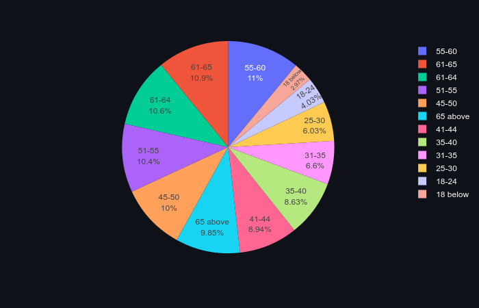
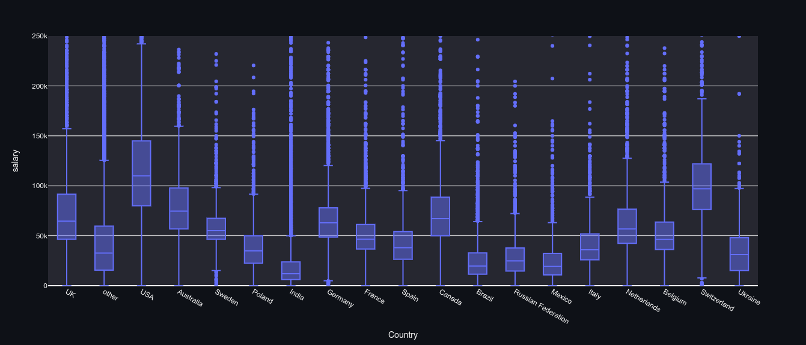
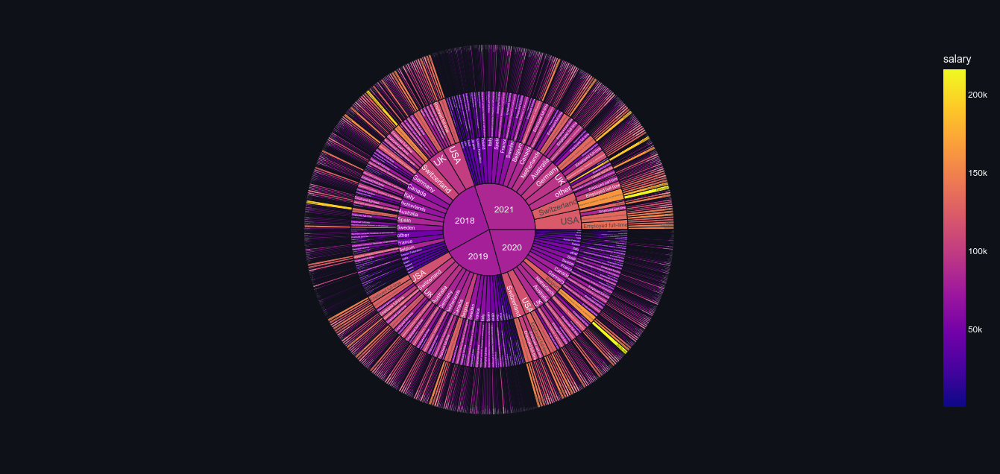

# DS_StackOver_Flow_Salary_Prediction-_-_Data_Exploration - URL: https://so-survey.herokuapp.com/
Working with Stack overflow survey data and building a simple salary prediction model and using data for exploration and visualization to gain insights into the data.

# Software Engineer Salary Estimator & Data Visualization: Project Overview
* Created a tool that estimates Software Engineer salaries (MSE ~ $ 27.7K) to help Software Engineers negotiate their income based on various factors
  when they find a job.
* Downloaded data sets from surevey data on Stack-Overflow website for the years 2018,2019,2020 & 2021.
## Dataset 1 - Prediction Page
* Used the 2021 dataset to build the predictor model, since that would yield the most relevant results in terms of salary.
* Kept Years of experience, country and education level as final features for the model.
* Label encoded above features after cleaning text and numerical values.
* Optimized Linear,Decision Trees,Random Forest Regressor and XGBoost using GridsearchCV to reach the best model.
* used forex-python to convert the salary ouput to suit the desired currency selected by the client.
* Built a client facing API using Streamlit.
* Deployed the API on Heroku cloud platform.
## Dataset 2 - Explore Page
* Used the 2018,2019,2020 & 2021 dataset for data visualizxation and data exploration.
* I used data from above four years only, since there was some commonality in the information recieved during the survey.
* The website host data sets started from 2012, but it was difficult to align and extract data and features from those datasets.
* Finalized features for data exploration - Age,Gender,Sexual Orientation,Country,Languages workin with and desire to work with,education level,
  employment stsatus,salary and year.
* Had to input exchange rates for the year 2018 and calculate yearly salary from that.
* Rest of the datasets had annually calculated and converted salary amounts already present.
* Used matplotlib,Plotly and Seaborn for data visualization and exploratory analysis on all features and comibination of features.
* Deployed the API on Heroku cloud platform.

## Completed project on : https://so-survey.herokuapp.com/

## Code and Resources Used
**Python Version:** 3.9  
**Data**:https://insights.stackoverflow.com/survey
**Packages:** pandas, numpy, sklearn, matplotlib,plotly, seaborn,streamlit, json, pickle  
**For Web Framework Requirements:**  ```pip install -r requirements.txt```  
**Salary predictor Github:** https://github.com/python-engineer/ml-app-salaryprediction
**STREAMLIT Dashboard deployment article:** https://gilberttanner.com/blog/deploying-your-streamlit-dashboard-with-heroku/
**Flask Productionization:** https://towardsdatascience.com/productionize-a-machine-learning-model-with-flask-and-heroku-8201260503d2
**Youtube video-STREAMLIT app and machine learning model:** https://www.youtube.com/watch?v=xl0N7tHiwlw
**Youtube video-Heroku deployment:** https://www.youtube.com/watch?v=nJHrSvYxzjE
Dataset 1 that contains data from 2021. This data set was used for model building.
You may find the dataset with the name surver_results_public.csv

Dataset 2 that contains data from 2018,2019,2020 and 2021. This data set was used for Data visualization on the Explore page.
You may find the dataset with the name clean_df.csv


## Data Cleaning -
After downloading and reading the datasets, I needed to clean it up so that it was usable for our model. I made the following changes and created the following variables:

*	Parsed numeric data out of salary
*	Made columns for salary
*	Removed rows without salary
*	Parsed ages into age groups.
*	Shortened country catogories.
*	Pasred Sexual orientation, gender, education level and employment status into definite cataegories to work with.
*	Parsed languages to work with and working with so that they can be concatenated into a complete string.


## EDA
Some snippets from the explore page on the Heroku cloud platform.






## Model Building - Dataset 1

First, I transformed the categorical variables using. I also split the data into train and tests sets with a test size of 25%.   

I tried three different models and evaluated them using Mean Absolute Error. I chose MAE because it is relatively easy to interpret and outliers aren’t particularly bad in for this type of model.   

I tried four different models:
*	**Linear Regression**
*	**Decision Trees**
*	**Random Forest**
*   **XGBoost**

## Model performance tuned after GridSearchCV
The Random Forest model outperformed the other approaches on the test and validation sets.
*	**Random Forest** : MSE = 27.73K
*	**Decision Tree**: MSE = 28.40K
*	**XGBoost Regression**: MSE = 28K

## Productionization and Deployment
In this step, I built a Streamlit dashboard based on Flask that was hosted on a Heroku webserver by following along with the tutorial in the resources section above.
Predict page - The dashboard takes inputs from client and outputs predicted salary based on machine learning model used.
Explore page - This page showcases all the objects created using data visualization modules which are interactive and informative.
